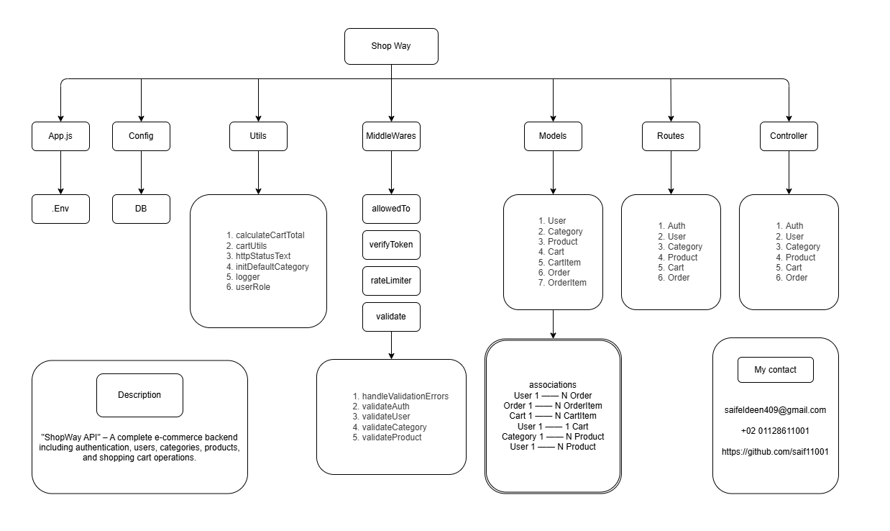

# ShopWay

ShopWay is a full-stack **E-commerce API** built with **Node.js, Express and MySQL (Sequelize)**.
It provides authentication **(JWT + refresh tokens in cookies)**, role-based access **(user/manager/admin)**, product & category management, cart & order flows, and image upload support.

---

## Features

- User authentication & authorization (Register, Login, Logout) with **JWT** and refresh tokens stored in DB + HTTP-only cookies.
- Role-based access control: **user, manager, admin**.
- Product CRUD (Add / Update / Delete / View) with image upload support.
- Category CRUD and safe deletion (products moved to default category).
- Shopping cart: add/remove items, update quantity (transactional, stock-aware).
- Orders: checkout (creates order from cart) and list user orders.
- Pagination & search on lists (products, users, categories).
- File upload with **multer**; product images in uploads/products/, user avatars in uploads/users/.
- Input validation using **express-validator** and centralized error handling.
- Rate limiting for sensitive endpoints (auth, product/category actions).
- Security basics: helmet, CORS config, password hashing with bcrypt.
- Structured logging via **pino**.

---

## Tech Stack

- **Backend:** Node.js, Express.js
- **Database:** MySQL (via Sequelize ORM)
- **Authentication:** JWT (access + refresh), bcrypt
- **File Upload:** multer (local disk storage; uploads served via /uploads)
- **Validation:** express-validator
- **Security** & Hardening: helmet, express-rate-limit, cookie-parser, CORS
- **Logging:** pino + pino-pretty
- **Config & Env:** dotenv

---

## Project Structure



---

## Getting Started

1. Clone the repository:
   ```bash
   git clone https://github.com/saif11001/ShopWay.git
   cd ShopWay
      
2. Install dependencies:
   ```bash
   npm install

3. Create a .env file with the following variables:
   ```bash
   # Database (MySQL)
   DB_NAME=shopway
   DB_USER=root
   DB_PASS=your_db_password
   DB_HOST=localhost
   DB_DIALECT=mysql

   # JWT keys
   JWT_SECRET_KEY=your_long_random_access_secret
   JWT_REFRESH_SECRET=your_long_random_refresh_secret

   # Server
   PORT=6060

   # Optional (frontend origin)
   CLIENT_URL=http://localhost:3000

4. Start the server:
   ```bash
   npm start

---

## API Endpoints (Examples)
### **Auth**

- POST /api/auth/register
    - Body: firstName, lastName, email, password, userRole?
    - Optional file: avatar (multipart/form-data)
    - Returns access & refresh tokens as cookies and user info.
- POST /api/auth/login
    - Body: email, password
    - Returns cookies + user info.
- POST /api/auth/logout
    - Requires authentication (verifyToken). Clears tokens.

### **User**

- GET /api/user/all
    - Admin only. Pagination & search supported (?page=&limit=&search=).
- GET /api/user/me
    - Get current user (auth required).
- PATCH /api/user/me
    - Update current us- er (auth required). Accepts multipart avatar (file) + other fields (firstName, lastName, email, password, userRole — role change limited).
    - When uploading new avatar, old file is removed from disk.
- DELETE /api/user
    - Delete current user (auth required). Avatar file is removed. User deletion rules depend on role (orders check, manager → products set inactive).

### **Categories**

- GET /api/category
    - List categories (pagination, search).
- GET /api/category/:id
    - Get specific category.
- POST /api/category
    - Admin only. Body: name.
- PUT /api/category/:id
    - Admin only. Update category name.
- DELETE /api/category/:id
    - Admin only. Deletes category safely — reassigns related products to default category (Other). Large moves use batch processing inside a DB transaction.

### **Products**

- GET /api/product
    - List products (pagination, search by title/brand or numeric search on price).
- GET /api/product/:id
    - Get product details.
- POST /api/product
    - Manager (or admin per your logic) required. Accepts multipart form with single file image and product fields (title, price, - short_description, long_description, brand, status, quantity, categoryId). Stores image under uploads/products/.
- PUT /api/product/:id
    - Manager required — update product fields and optionally new image. When replacing image, old file is removed.
- DELETE /api/product/:id
    - Manager required — deletes product and removes image file from disk.

### **Cart**

- GET /api/cart
    - Get current user's cart (formatted + total price).
- POST /api/cart
    - Add item to cart. Body: { productId } (controller handles creating cart, cartItem, stock adjustments in a transaction).
- PUT /api/cart
    - Update cart item. Body: { productId, action } (action: increment or decrement).
- DELETE /api/cart
    - Remove item from cart. Body: { productId } (restores product stock).

### **Orders**

- POST /api/order
    - Checkout — creates an order from the current cart (transactional), creates OrderItems and clears cart items. Body: { paymentMethod, address, phone, note }.
- GET /api/order
    - Get all orders for the current user (with order items + product info).

### **File Uploads & Access**

- Uploaded images are stored locally under uploads/:
    - uploads/products/ for product images
    - uploads/users/ for avatars
- Files are served statically from /uploads (e.g. http://localhost:6060/uploads/products/xyz.jpg).

---

## Future Improvements

- Admin dashboard (analytics, product/user/order management).
- Add product reviews & ratings.
- Email notifications (order confirmations, password reset).
- Integrate Stripe (or other) for payments and order state transitions (paid, shipped, delivered).
- Move file storage to cloud (AWS S3 / Cloud Storage) for reliability and scalability.
- Add automated tests (unit + integration).

---

## Author

**Saif Eldeen Sobhi**

- LinkedIn: [linkedin.com/in/saif-eldeen-sobhy](https://www.linkedin.com/in/saif-eldeen-sobhy/)  
- Email: saifeldeen409@gmail.com